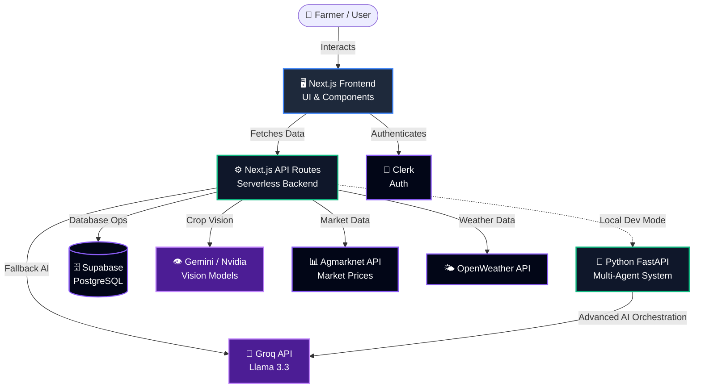

<div align="center">

# 🌾 KisanSeva 

**AI-Powered Multi-Agent Agricultural Advisory System**

[](https://nextjs.org/)
[](https://fastapi.tiangolo.com/)
[](https://tailwindcss.com/)
[](https://supabase.com/)
[](https://vercel.com)

KisanSeva is a comprehensive platform built to empower farmers with real-time market prices, crop disease diagnosis, localized weather forecasts, and a conversational AI assistant composed of 7 specialized agricultural agents.

</div>

---

## 🚀 Key Features in Detail

### 1. 🤖 7-Agent AI Advisory System (KisanSeva Saathi)
A highly advanced, conversational AI assistant composed of 7 specialized agents (Diagnosis, Weather, Market, Soil Health, Outbreak Monitor, Knowledge Base, and SMS/IVR). 
- **Voice-Activated & Multilingual:** Farmers can click the microphone to speak in English, Hindi, or Bengali. The AI responds natively in their language.
- **Context-Aware Routing:** The AI orchestrator automatically routes the farmer's question to the correct specialized agent (e.g., asking about prices routes to the Market Agent).

### 2. 👁️ Crop Disease Diagnosis (Vision AI)
Farmers can upload a photo of a diseased crop directly from their phone.
- **Multi-Model Support:** Choose between **Google Gemini Vision** or **Nvidia NIM Vision** to instantly scan the leaf.
- **Actionable Treatment Plans:** The AI identifies the disease, explains the cause, and provides step-by-step biological and chemical treatment recommendations.

### 3. 📊 Live B2B Market Prices (Agmarknet Integration)
A real-time marketplace dashboard designed to help farmers get the best prices for their harvest.
- **Live Mandi Data:** Pulls real-time agricultural market prices directly from the Government of India's Agmarknet database.
- **Price Trends & Analytics:** View historical charts and AI-generated summaries to decide when and where to sell.

### 4. 🌤️ Localized Weather & Irrigation Advisory
Integrated with the OpenWeatherMap API to provide hyper-local weather data based on the farmer's GPS location.
- **Irrigation Scheduling:** The AI uses the temperature, humidity, and forecast to recommend exactly how much water specific crops need for the week.

### 5. 🌱 Soil Health & Fertilizer Planning
A dedicated module where farmers can input their soil type or NPK values to receive a customized fertilizer schedule, ensuring maximum yield without degrading the soil quality.

### 6. 🗺️ Interactive Farm Mapping
Features an interactive map built with Leaflet and MapTiler, allowing farmers to visualize regional data, nearby markets, and agricultural zones directly on the dashboard.

---

## 🛠️ Tech Stack

### Frontend
- **Framework:** Next.js 14 (App Router), React 19
- **Styling:** Tailwind CSS, Framer Motion (Animations)
- **State Management:** Zustand
- **Maps:** Leaflet & MapTiler

### Backend & Cloud
- **API:** Next.js Serverless Functions
- **Database:** Supabase (PostgreSQL)
- **Authentication:** Clerk
- **Hosting:** Vercel

### Machine Learning & AI
- **Framework:** Python, FastAPI, Uvicorn
- **AI Orchestration:** LangChain
- **LLMs:** Groq (Llama-3.3-70b), Google Gemini Vision, Nvidia NIM
- **Data Integration:** Agmarknet API, OpenWeatherMap

---

## 🏗️ Visual Architecture



*Note: When hosted on Vercel, the Next.js API gracefully falls back to using the Groq API directly if the local Python ML service is offline.*

---

## 📂 Folder Architecture

The project is structured as a **Turborepo** monorepo containing two main applications:

```text
kisan_seva/
├── apps/
│   ├── web/                     # 🌐 Next.js Frontend & API Routes
│   │   ├── src/
│   │   │   ├── app/             # App Router (Pages, Layouts, API Routes)
│   │   │   ├── components/      # Reusable React UI Components
│   │   │   ├── hooks/           # Custom Hooks (e.g., useVoiceChat)
│   │   │   └── lib/             # Utilities (Zustand store, Supabase client)
│   │   └── package.json         # Frontend Dependencies
│   │
│   └── ml-service/              # 🧠 Python ML & AI Backend
│       ├── agents/              # 7 Specialized LangChain Agents
│       ├── knowledge_base/      # RAG Documents & Embeddings
│       ├── utils/               # Helper functions & data processing
│       ├── main.py              # FastAPI entry point
│       └── requirements.txt     # Python Dependencies
│
├── package.json                 # Root dependencies and Turborepo scripts
└── turbo.json                   # Monorepo build configurations
```

---

## ⚙️ How to Run Locally

You have two options for running the project locally depending on what you want to test.

### Option 1: Quick Start (Frontend + Cloud AI)
Run this if you just want to see the UI. The AI features will automatically fall back to using the cloud Groq API.

1. Install dependencies in the root folder:
   ```bash
   pnpm install
   ```
2. Start the web frontend:
   ```bash
   pnpm run dev
   ```
3. Open `http://localhost:5173` in your browser.

### Option 2: Full Stack (Frontend + Python Multi-Agent Backend)
Run this if you want to test the full 7-agent Python orchestration system locally. You will need **two terminal windows**.

**Terminal 1 (Start the Python ML Server):**
```bash
cd apps/ml-service
# Activate your virtual environment
.\.venv\Scripts\activate   # Windows
# source .venv/bin/activate # Mac/Linux

# Start the FastAPI server
uvicorn main:app --reload --port 8000
```

**Terminal 2 (Start the Web Frontend):**
```bash
# From the root repository folder
pnpm run dev
```
Open `http://localhost:5173` in your browser. The web app will now automatically detect and use your local Python ML server!

---

## 🔐 Environment Variables

To run the project, ensure you have the required API keys configured in `apps/web/.env.local`:
- `GROQ_API_KEY` (AI Chatbot)
- `GEMINI_API_KEY` & `NVIDIA_NIM_KEY` (Crop Vision)
- `NEXT_PUBLIC_CLERK_PUBLISHABLE_KEY` & `CLERK_SECRET_KEY` (Auth)
- `NEXT_PUBLIC_SUPABASE_URL` & `NEXT_PUBLIC_SUPABASE_ANON_KEY` (Database)

*(For production deployments, these are securely configured in Vercel).*

---

## 👨‍💻 Owner & Credits

Designed and developed by **Abhranil Singha Roy**.

Built with passion for agricultural innovation and AI technology. 🌾
