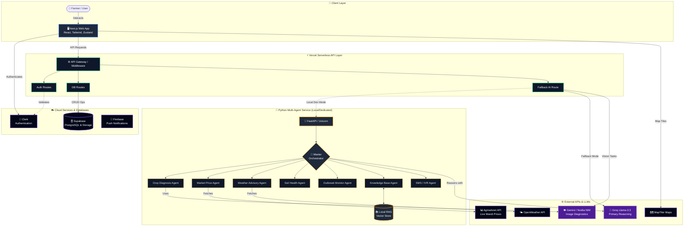

<div align="center">

# 🌾 KisanSeva 

**AI-Powered Multi-Agent Agricultural Advisory System**

[](https://nextjs.org/)
[](https://fastapi.tiangolo.com/)
[](https://tailwindcss.com/)
[](https://supabase.com/)
[](https://vercel.com)

KisanSeva is a comprehensive platform built to empower farmers with real-time market prices, crop disease diagnosis, localized weather forecasts, and a conversational AI assistant composed of 7 specialized agricultural agents.

</div>

---

## 🚀 Key Features in Detail

### 1. 🤖 7-Agent AI Advisory System (AI Agent & Chatbot)
A highly advanced, conversational AI assistant composed of 7 specialized agents. 
- **Voice-Activated & Multilingual:** Farmers can click the microphone to speak in English, Hindi, or Bengali. The AI responds natively in their language.
- **Context-Aware Routing:** The AI orchestrator automatically routes the farmer's question to the correct specialized agent.

### 2. 👁️ Crop Diagnose (Vision AI)
Farmers can upload a photo of a diseased crop directly from their phone.
- **Multi-Model Support:** Choose between **Google Gemini Vision** or **Nvidia NIM Vision** to instantly scan the leaf.
- **Actionable Treatment Plans:** The AI identifies the disease, explains the cause, and provides step-by-step biological and chemical treatment recommendations.

### 3. 📊 Live B2B Market & Pricing (Agmarknet)
A real-time marketplace dashboard designed to help farmers get the best prices.
- **Live Mandi Data:** Pulls real-time agricultural market prices directly from the Government of India's Agmarknet database.
- **Price Trends & Analytics:** View historical charts and AI-generated summaries to decide when and where to sell.

### 4. 🗺️ Farm Map & Weather Advisory
Features an interactive map built with Leaflet and MapTiler, allowing farmers to visualize regional data.
- **Localized Weather:** Integrated with OpenWeatherMap API to provide hyper-local weather data.
- **Irrigation Scheduling:** The AI uses the temperature and forecast to recommend watering schedules.

### 5. 🌱 Soil Health & My Plots
- **Fertilizer Planning:** Farmers can input their soil type or NPK values to receive a customized fertilizer schedule.
- **My Plots:** Track and manage individual farm plots, monitor crop lifecycles, and schedule harvesting tasks.

### 6. 🤝 Community SOS & Kisan Sabha
- **SOS Emergency Broadcast:** Instant emergency alerts (locust attacks, severe weather, sudden disease outbreaks) broadcast to nearby farmers.
- **Kisan Sabha:** A community forum where farmers can connect, discuss local agricultural issues, and share traditional knowledge.

### 7. 🚜 Agri-Credit, Schemes & Equipment
- **Agri-Credit:** Built-in loan calculators and credit advisory to help farmers secure financial support.
- **Government Schemes:** AI-curated list of eligible government agricultural schemes.
- **Equipment:** A hub for managing, renting, or buying modern farming machinery.

### 8. 🔗 Crop Traceability
- **Farm-to-Fork Tracking:** A robust system to track the lifecycle of the crop, generating QR codes to prove authenticity and organic status to B2B buyers.

---

## 🛠️ Tech Stack

### Frontend
- **Framework:** Next.js 14 (App Router), React 19
- **Styling:** Tailwind CSS, Framer Motion (Animations)
- **State Management:** Zustand
- **Maps:** Leaflet & MapTiler

### Backend & Cloud
- **API:** Next.js Serverless Functions
- **Database:** Supabase (PostgreSQL)
- **Authentication:** Clerk
- **Hosting:** Vercel

### Machine Learning & AI
- **Framework:** Python, FastAPI, Uvicorn
- **AI Orchestration:** LangChain
- **LLMs:** Groq (Llama-3.3-70b), Google Gemini Vision, Nvidia NIM
- **Data Integration:** Agmarknet API, OpenWeatherMap

---

## 🏗️ Visual Architecture



*Note: When hosted on Vercel, the Next.js API gracefully falls back to using the Groq API directly if the local Python ML service is offline.*

---

## 📂 Detailed Folder Architecture

The platform uses a **Turborepo** monorepo structure to perfectly organize the Next.js frontend and the Python Machine Learning service.

```text
kisan_seva/
├── turbo.json                   # Monorepo task runner configuration
├── package.json                 # Root dependencies and workspace definitions
│
├── apps/
│   ├── web/                     # 🌐 Next.js Frontend Application
│   │   ├── src/
│   │   │   ├── app/             # Next.js App Router (Pages & API)
│   │   │   │   ├── api/v1/      # Serverless API routes (B2B, market, diagnose, weather, TTS)
│   │   │   │   └── [locale]/    # Internationalized routing for EN, HI, BN
│   │   │   │       ├── (app)/   # Protected dashboard routes (schedule, market, diagnose)
│   │   │   │       └── (public)/# Public marketing pages and landing page
│   │   │   │
│   │   │   ├── components/      # Modular React UI Components
│   │   │   │   ├── chat/        # Floating chatbot UI, message bubbles, language selector
│   │   │   │   ├── features/    # Core feature UI (Mandi tables, diagnosis scanners, charts)
│   │   │   │   ├── home/        # Landing page components (Hero, Testimonials, Map visualizations)
│   │   │   │   ├── layout/      # Navbar, AgriFooter, offline indicators, translation widgets
│   │   │   │   └── ui/          # Generic reusable elements (buttons, full-page scrollers)
│   │   │   │
│   │   │   ├── hooks/           # Custom React hooks
│   │   │   │   └── useVoiceChat.ts # Handles microphone access, speech-to-text, and fallback logic
│   │   │   │
│   │   │   ├── lib/             # Core Utilities & State Management
│   │   │   │   ├── chatStore.ts # Zustand global state manager for the AI chat history
│   │   │   │   └── supabase/    # Supabase authentication and database clients (server/client)
│   │   │   │
│   │   │   ├── i18n/            # next-intl configuration and translation dictionaries
│   │   │   ├── .env.production  # Production environment variables (auto-synced to Vercel)
│   │   │   ├── middleware.ts    # Clerk Auth and Next-Intl routing interceptors
│   │   │   ├── next.config.ts   # Next.js compiler settings and PWA configuration
│   │   │   └── tailwind.config.ts # Custom Tailwind theme colors and animations
│   │
│   └── ml-service/              # 🧠 Python Multi-Agent & Machine Learning Backend
│       ├── main.py              # FastAPI server entry point (routes requests to the Orchestrator)
│       ├── requirements.txt     # Python dependencies (FastAPI, LangChain, Uvicorn, Torch)
│       │
│       ├── agents/              # The 7-Agent Architecture
│       │   ├── orchestrator/    # The "Brain" that decides which agent should answer
│       │   │   ├── master_orchestrator.py
│       │   │   └── agent_registry.py
│       │   ├── specialist/      # The specific "Expert" agents
│       │   │   ├── diagnosis_agent.py      # Handles crop diseases
│       │   │   ├── mandi_price_agent.py    # Fetches real-time Agmarknet data
│       │   │   ├── weather_advisory_agent.py # Connects to OpenWeather
│       │   │   ├── soil_health_agent.py    # Generates NPK fertilizer plans
│       │   │   ├── outbreak_detection_agent.py
│       │   │   ├── sms_ivr_agent.py        
│       │   │   ├── knowledge_base_agent.py # RAG queries
│       │   │   └── feedback_agent.py       # Collects user feedback
│       │   └── base/
│       │       └── base_agent.py # LangChain base class template for all agents
│       │
│       ├── knowledge_base/      # RAG (Retrieval-Augmented Generation) System
│       │   ├── crop_disease_db.py
│       │   └── vector_store.py  # Embeddings for agricultural documents
│       │
│       ├── training/            # Custom Model Training Scripts (Future-proofing)
│       │   ├── scripts/         # Scripts for Google Colab model training and evaluation
│       │   ├── configs/         # Model hyperparameter configs
│       │   └── data/            # Dataset loaders for images
│       │
│       └── utils/               # Python Utility Functions
│           ├── llm_client.py    # Connection to Groq Llama-3.3-70b
│           ├── image_utils.py   # Processes images for Gemini/Nvidia NIM
│           ├── language_utils.py # Translation layer
│           └── sentry_init.py   # Error tracking
```

---

## ⚙️ How to Run Locally

You have two options for running the project locally depending on what you want to test.

### Option 1: Quick Start (Frontend + Cloud AI)
Run this if you just want to see the UI. The AI features will automatically fall back to using the cloud Groq API.

1. Install dependencies in the root folder:
   ```bash
   pnpm install
   ```
2. Start the web frontend:
   ```bash
   pnpm run dev
   ```
3. Open `http://localhost:5173` in your browser.

### Option 2: Full Stack (Frontend + Python Multi-Agent Backend)
Run this if you want to test the full 7-agent Python orchestration system locally. You will need **two terminal windows**.

**Terminal 1 (Start the Python ML Server):**
```bash
cd apps/ml-service
# Activate your virtual environment
.\.venv\Scripts\activate   # Windows
# source .venv/bin/activate # Mac/Linux

# Start the FastAPI server
uvicorn main:app --reload --port 8000
```

**Terminal 2 (Start the Web Frontend):**
```bash
# From the root repository folder
pnpm run dev
```
Open `http://localhost:5173` in your browser. The web app will now automatically detect and use your local Python ML server!

---

## 🔐 Environment Variables

To run the project, ensure you have the required API keys configured in `apps/web/.env.local`:
- `GROQ_API_KEY` (AI Chatbot)
- `GEMINI_API_KEY` & `NVIDIA_NIM_KEY` (Crop Vision)
- `NEXT_PUBLIC_CLERK_PUBLISHABLE_KEY` & `CLERK_SECRET_KEY` (Auth)
- `NEXT_PUBLIC_SUPABASE_URL` & `NEXT_PUBLIC_SUPABASE_ANON_KEY` (Database)

*(For production deployments, these are securely configured in Vercel).*

---

## 👨‍💻 Owner & Credits

Designed and developed by **Abhranil Singha Roy**.

Built with passion for agricultural innovation and AI technology. 🌾
